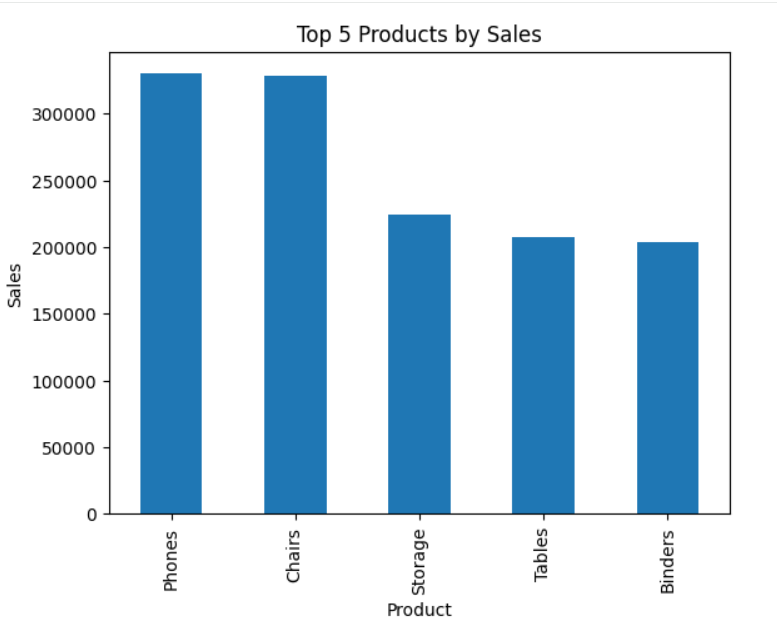
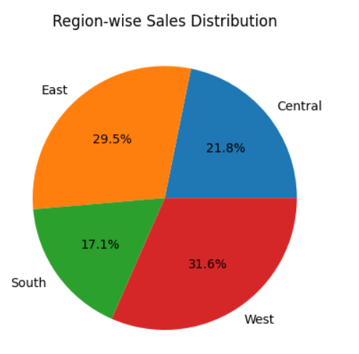

# sales-data-analysis-project

## Overview
This project analyzes sales data using Python, SQL, and Power BI.

## Tools Used
- Python (Pandas)
- SQL
- Power BI

## Steps Performed
- Data Cleaning
- Data Analysis
- Data Visualization

## Key Insights
- Identified top-performing categories
- Analyzed regional sales trends

## Visualizations

### Graph 1

Graph 1 shows top 5 products by sales

### Graph 2

Graph 2 shows region wise sales

## Author
Vanavasam Bhavya
